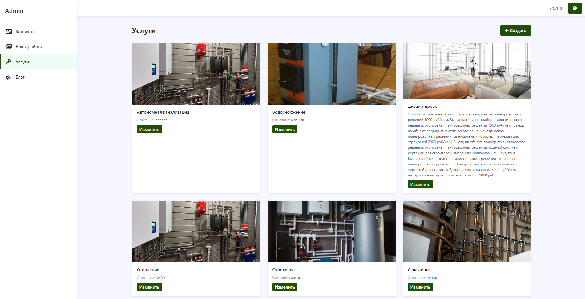

## Description:
This site is a simple example of a site with a blog and a gallery of works. The site is built on the Laravel framework.
## Features:
1. Blog
2. Gallery
3. Contact form
4. SSL/TLS
5. Admin panel
6. SEO
7. Sitemap
8. Services

# Example of the result:

## Dependencies:
1. [Docker](https://www.docker.com/)
1. [docker-compose](https://github.com/docker/compose)
1. DNS [Cloudflare](https://www.cloudflare.com/)
## Launch:
1. Connect your website to cloudflare. 
2. In the file [.env](.env) write:  
2.1. Your domain to the DOMAIN variable  
2.2. Site name APP_NAME  
2.3. Mail linked to cloudflare CLOUDFLARE_EMAIL get [here](https://dash.cloudflare.com/profile)  
2.4. Cloudflare Global api key CLOUDFLARE_API_KEY get [here](https://dash.cloudflare.com/profile/api-tokens)  
2.5. According to the smtp connection standard, configure these variables MAIL_PORT MAIL_HOST MAIL_USERNAME MAIL_PASSWORD MAIL_FROM_ADDRESS  
2.6. Administrator's email APP_MAIL  
3. `chmod +x run.sh` Grant rights to execute the script
4. `./run.sh` Run the project

### Example of SSL/TLS configuration
 
****
## Additional:
To restart the project and get new updates, write `./restart.sh`.
